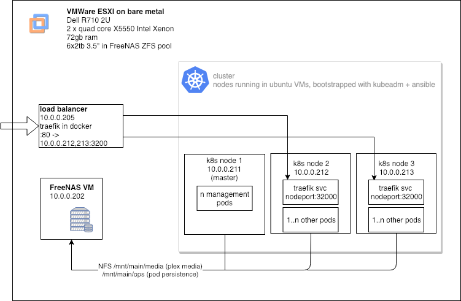
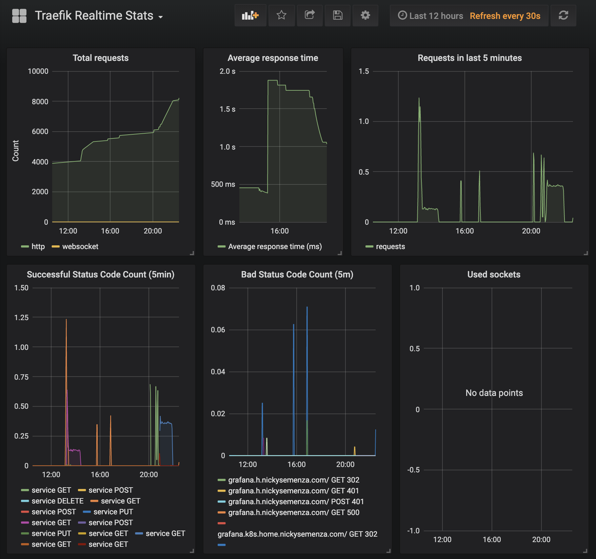
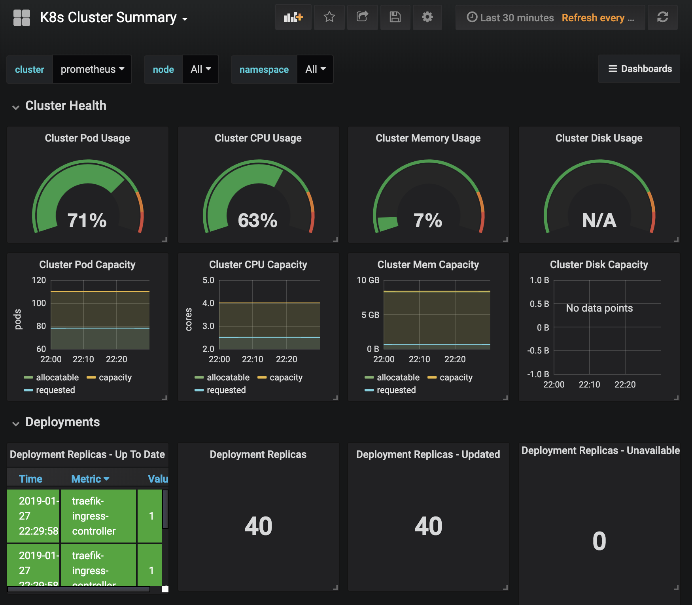

# Background

While in college, I wanted an economical way to have a solid storage solution for my 2.5TB of photos (25mb+ each...) that didn't involve portable hard drives.
A 4-drive Synology/QNAP NAS goes for around $400, and 4x2tb drives would cost about $400 bucks, giving me 6TB of usable storage in RAID5. $800 is much cheaper than if you price that out for S3 or any other cloud solution, but it still felt pretty expensive. My searching brought me another option: A used rackmount server. $520 later, A Dell R710 showed up on my doorstep. Not only did it have a whopping **six** 2TB server-grade drives included, but it also included 72gb of ram, and two physical Xenon CPUs! I didn't want to "waste" all the power on just a storage server, so I installed VMWare ESXI as the operating system. I then enabled passthrough for the SATA bus to FreeNAS VM, allowing it to have full control over them, created a ZFS pool, and that was that.

It's been a couple years, and everything is running smoothly. FreeNAS uses about 8GB of memory, barely any CPU, and I have a couple TB free still. _Why not install a kubernetes cluster?_

## Why Kubernetes?

I have a secondary VM with a couple servies running in docker-compose, mostly media or home automation related - plex, home-assistant, transmission-openvpn, [hyperion](https://github.com/nickysemenza/hyperion) Granted this solution is simple _and_ stable, but I wanted to experiment with rolling my own k8s cluster, since I have the resources laying around.
Kubernetes is quickly becoming the defacto for running docker applications in prodution - I use it both for personal projects on GKE, as well as at work. Perhaps I'll move all of my services over once it's stable, but honestly, for non-production things, docker-compose is just simple - 5 lines of yaml in one file and you're done for most services.

## Why not in the cloud?

Although I mount my FreeNAS data from within Google Cloud, there'd be an element of latency, and the data costs would be quite high - 100 gb of egress via a VPN tunnel would cost \$100/mo.

# The plan

All my 'nodes' will really be VMs - the only real requirement to be a node is to have a couple GB of ram and have some common flavor of linux. While I could just do a single node cluster, with it acting as both master and worker, that's a bit of an antipattern, and then we wouldn't get to play with inter-node networking! I'll have 2 workers and 1 master, each with 30gb storage, 8gb memory, and 4 virtual cpus. We won't be storing any user/pod data on the nodes' filesystems - only temp data such as the docker image cache, so not that much storage is necessary.

If we were in a cloud-managed k8s environment, such as EKS, GKE, or AKS we'd be able to use a kubernetes [LoadBalancer](https://kubernetes.io/docs/concepts/services-networking/#loadbalancer). This allows for pods to be accessible from outside the cluster, either via a public IP, or other systems on a private subnet. The best we'll get is a [NodePort](https://kubernetes.io/docs/concepts/services-networking/#nodeport) - we pick a port in the rage `30000-32767` for our service, and it will be Accessible via that port if we hit the ip of any node _which happens to be running the service_. We can ensure that all of our nodes are running a service by using a `DaemonSet` instead of a `Deployment`. But _what_ will we run as a DaemonSet? Why the [traefik ingress controller](https://traefik.io/) of course! Traefik will scrape all `Ingress` definitions in the cluster for the `kubernetes.io/ingress.class: "traefik"` annotations to build a map of which incoming requests are destined for which pods.
The simplest way to define an ingress, is based on the `host` - which looks at the Host header of incoming requests.

We'll do this later, but let's say we deploy traefik as a `DaemonSet`, with a `NodePort` of `32000` for the `web` port (as opposed to the `admin` port). Now, if a request is sent to `any_worker_ip:32000`, traefik will route it to the appropriate service.

Now we need to make our own loadbalancer. Let's use traefik! But this time logically _outside_ the cluster - but still in VM on the same physical host. This single instance of traefik will accept requests on port 80, and round-robin (or whatever we pick) route them to one of the upstreams: `[node1:32000, node2:32000]`. At this point we could poke a hole in our NAT to route `:80 -> load_balancer_vm_ip:80`. I opted to use Cloudflare's [Argo Tunnel](https://www.cloudflare.com/products/argo-tunnel/), so I don't have to expose my home network to the internet directly. It's basically a managed reverse proxy, you could roll your own using `https://github.com/fatedier/frp`

Another thing that comes with managed kubernetes clusters is easy storage. Inlieu of being able to mount a managed storage volume, we can allow our pods to persist data by using an nfs-backed `PersistentVolume` Here's what our (hypothetical) cluster looks like so far:


# Bootstrapping the cluster

[kubeadm](https://kubernetes.io/docs/reference/setup-tools/kubeadm) is an official k8s tool that will allow us to create a master and worker nodes, and join the workers to the master in a couple of steps. Instead of typing the exact same commands on our 2 worker nodes, we'll use ansible to make the process automated and repeatable. I adapted [this great guide from DigitalOcean](https://www.digitalocean.com/community/tutorials/how-to-create-a-kubernetes-1-11-cluster-using-kubeadm-on-ubuntu-18-04) to fit my needs.
The process looks like this:

1. on all nodes (and loadbalancer)
   - `apt-get` install dependencies (docker, kubelet, kubeadm)

- on the master
  - run `kubeadm init`
  - install pod networking extension
- on the workers
  - `kubeadm join` (using the token provided to us by the master earlier)
- on the loadbalancer
  - run traefik with a config listing all nodes as upstreams
  - insteall `clouflared`, initialize a tunnel to port 80

Once these steps are complete, we should be able to take the admin.conf that ansible copied from the master node, and use it to authenticate against our cluster

```bash
$ export KUBECONFIG=~/dev/cluster/bootstrap/output/admin.conf
$ kubectl get nodes
NAME       STATUS   ROLES    AGE    VERSION
k-node-1   Ready    master   2d2h   v1.13.2
k-node-2   Ready    worker   2d2h   v1.13.2
k-node-3   Ready    worker   2d2h   v1.13.2
```

## helm

People tend to debate about helm and whether or not it's overkill, especially since it requires a pod to be running on the server (it's called `tiller`) to work. [V3 will
remove that requirement](https://github.com/helm/community/blob/master/helm-v3/000-helm-v3.md), but I've found it to be easy for deploying system services without having to muck about with too many configs. Using the `stable/prometheus` chart, I can spin up grafana, prometheus, alertmanager, _and_ kube-state-metrics, and all I need to tweak are my ingress definitions.

If i'm deploying a dockerimage I wrote though, I wouldn't go write myself a helm chart, I'd just write a vanilla k8s manifest.

Before we can use it, we'll need to give it permissions:

```yaml
apiVersion: v1
kind: ServiceAccount
metadata:
  name: tiller
  namespace: kube-system
---
apiVersion: rbac.authorization.k8s.io/v1
kind: ClusterRoleBinding
metadata:
  name: tiller
roleRef:
  apiGroup: rbac.authorization.k8s.io
  kind: ClusterRole
  name: cluster-admin
subjects:
  - kind: ServiceAccount
    name: tiller
    namespace: kube-system
```

We can then run `helm init --service-account tiller`

## storage

My FreeNAS server has a static IP of `10.0.0.202`, I can fairly easily create a PersistentVolumeClaim backed by NFS:

```yaml
# MEDIA
apiVersion: v1
kind: PersistentVolume
metadata:
  name: nfs-media
spec:
  capacity:
    storage: 1Mi
  accessModes:
    - ReadWriteMany
  nfs:
    server: nfs-server-address-goes-here
    path: /mnt/main/media
---
kind: PersistentVolumeClaim
apiVersion: v1
metadata:
  name: nfs-media
spec:
  accessModes:
    - ReadWriteMany
  resources:
    requests:
      storage: 1Mi
```

Using it is now just like any other PVC:

```yaml
kind: Pod
apiVersion: v1
spec:
  containers:
    - name: example
      image: pleplexinc/pms-dockerxms
      volumeMounts:
        - mountPath: '/media'
          name: mediavol
  volumes:
    - name: mediavol
      persistentVolumeClaim:
        claimName: nfs-media
```

# monitoring

Using helm charts for grafana and prometheus, I can use some pre-baked dashboards to get some fun charts :)




