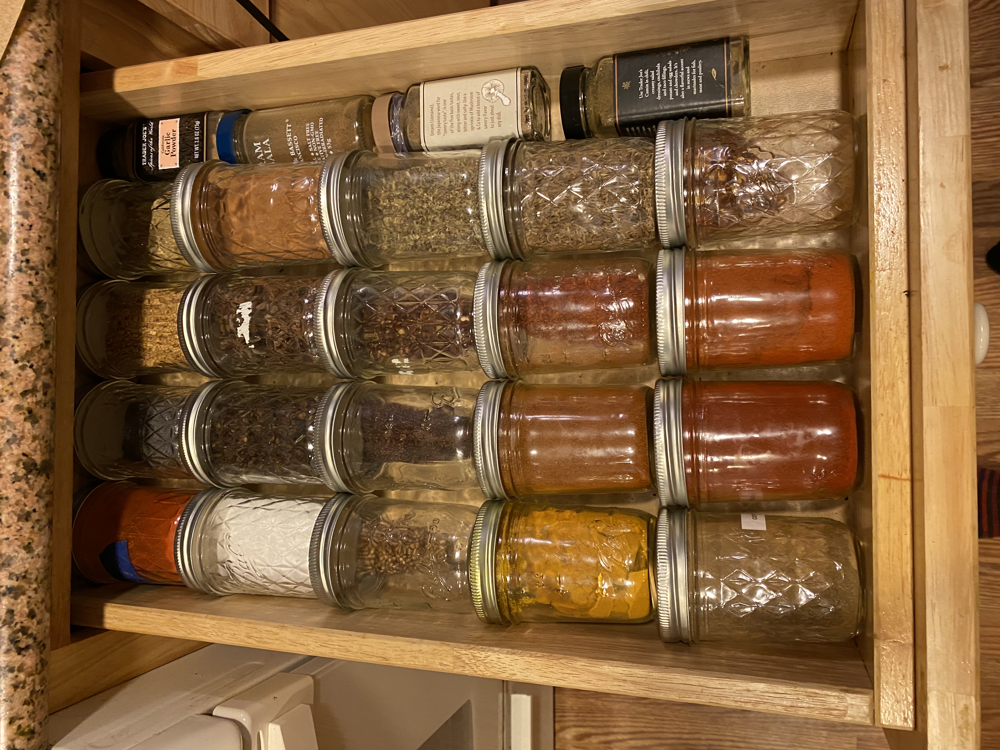
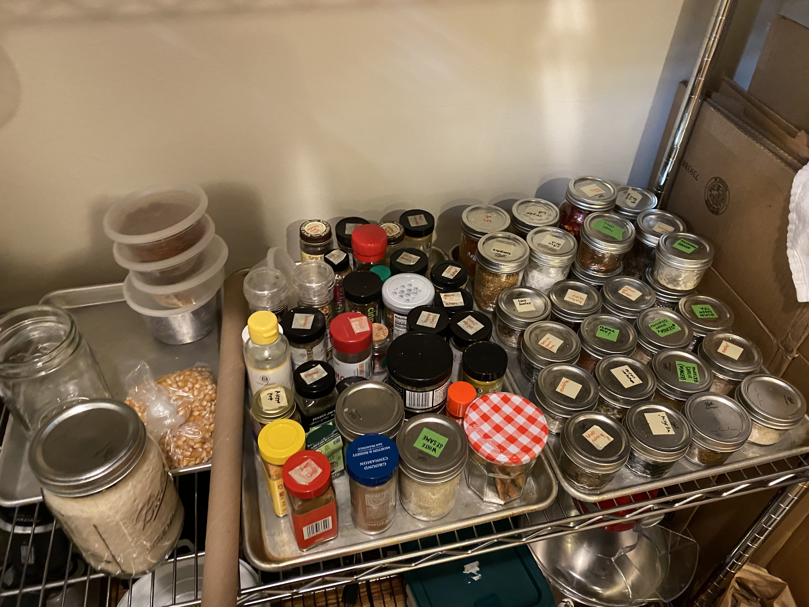
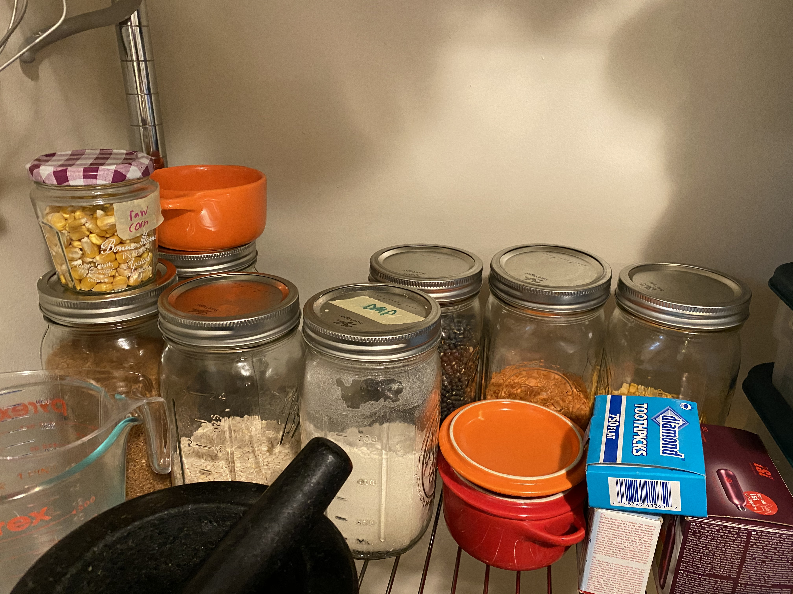
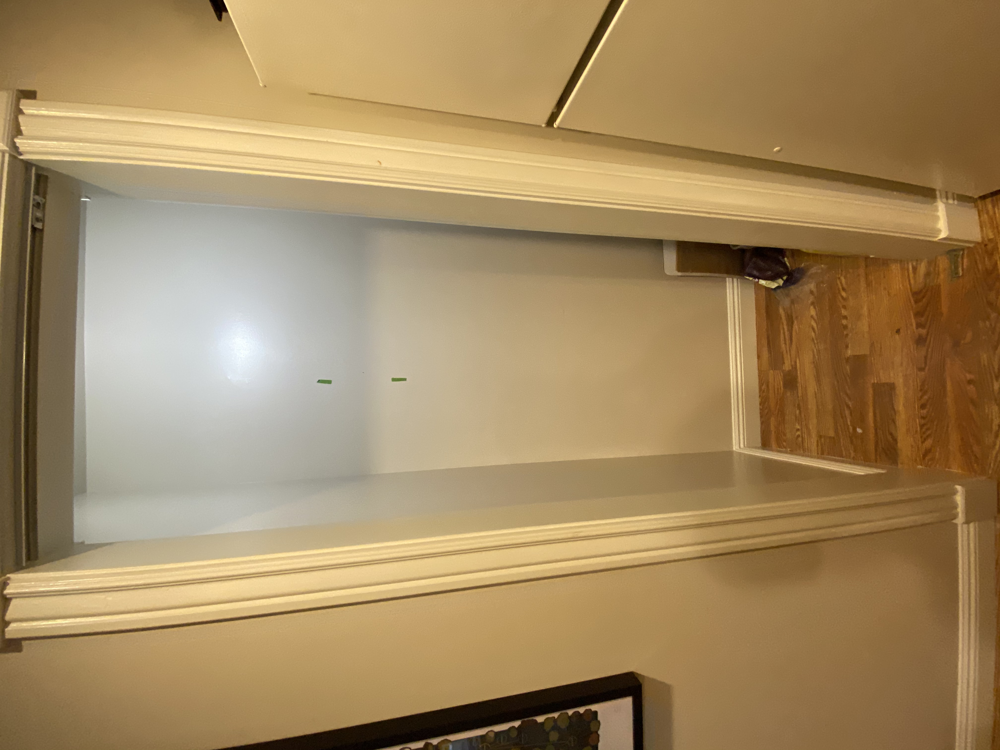
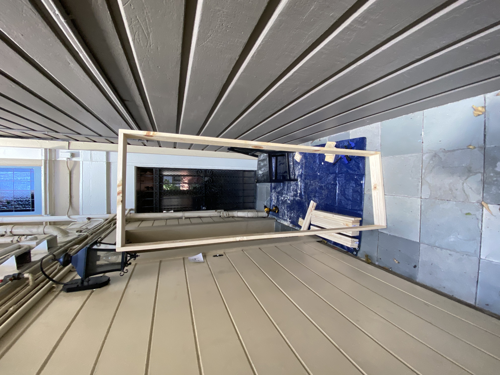
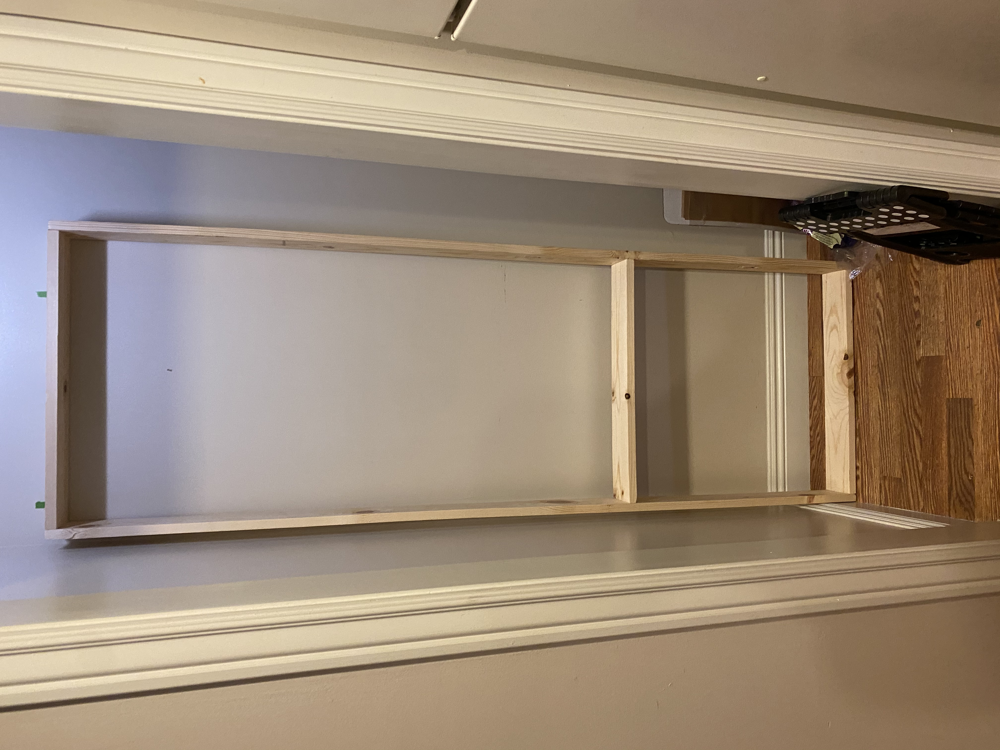
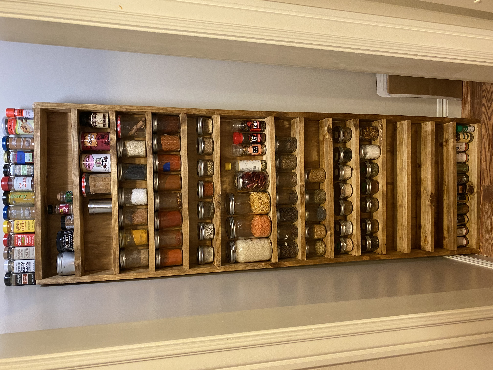

I have quite a plethora of different spices that I actually do use on a regular basis - within a given week i'd say I use about 20 or so different onces. I buy them in bulk since it's much cheaper and they tend to be fresher, and I keep them all in 4oz/8oz mason jars. However, it's kind of a mess keeping a ton of mason jars around. I
I have my most commonly used ones on in a drawer, and the rest on 2 half sheet pans on a storage rack. I also have some larger jars with dried goods.

  

I have a large unused wall in my tiny 'panty' so I figured that a mini-bookshelf for jars would fit quite nicely.

I haven't touched any CAD software since like 2014, but after some relearning I was able to make a plan:

I designed it to be 2 feet wide and 6 feet tall - This means the back could be made up of 2x4" sheets of plywood, and the sides could be 6" lengths of 1x3 - this was very important as I don't know anyone with a truck, and I wanted to minimize how much plywood I needed to rip.

Initially I planned to use dowels as a front retainer, but when I was building it I realized that those weren't really necessary, so I was able to create 14 rows instead of the 12 I planned for. Since the outer width is 2 feet and the 1x3s are each 0.75' wide, this means that the inside of each shelf would be 21.5 inches wide. This equates to like, 7.5 jars wide, but the plywood I got ended up being more like 24.5 inches wide, so I was able to squeeze in 8 jars per row! This gave me a capacity of **104 jars**, plus a bonus double-height shelf I decided to add.

I also don't have anything resembling a workshop, so I did this on a tarp in front of my front door.

my workbench...

