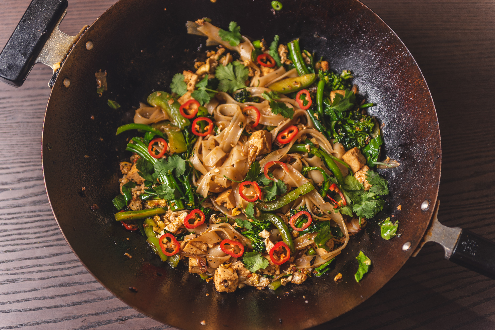
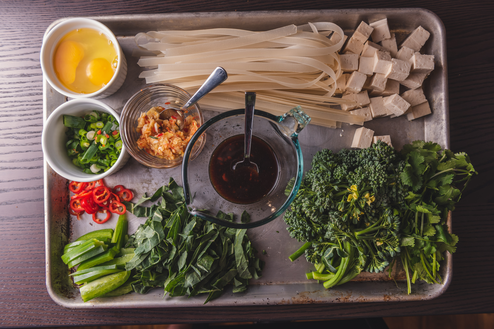
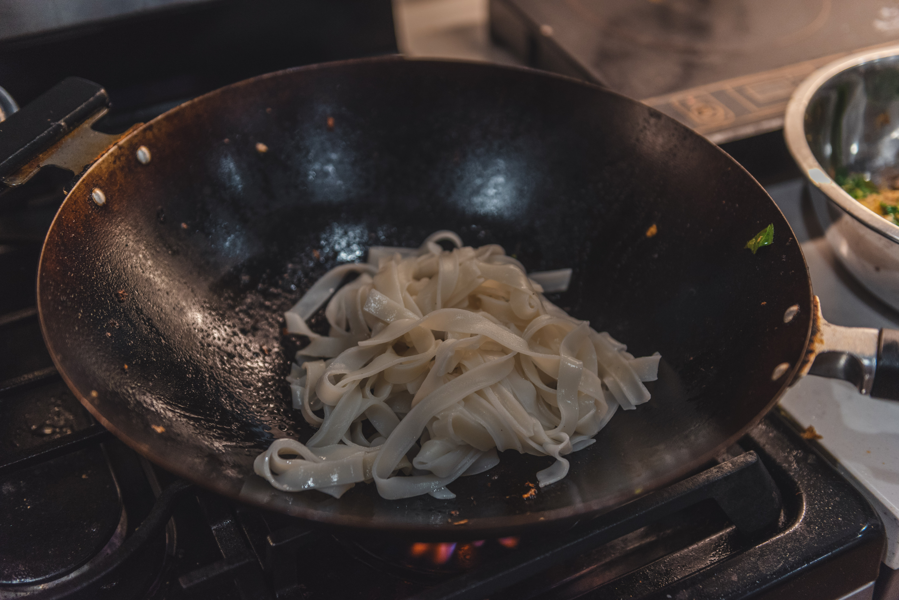

This is somewhere between _pad kee mao_ and _pad see ew_.

This is a very flexible recipe - you'll need some rice noodles, vegetables, and proteins, along with 2 other simple compomnents.

First, we'll need a **ginger chili garlic** paste. We can achieve this by grinding equal parts of minced ginger, garlic, and whatever spicy chilies you have on hand - thai, fresno, jalapeno, etc. A mortar and pestle is sbest for this as it'll fully macerate and extract the juices, but a food processor, or even a fine mince would do. Salt can aid with the maceration if a mortar is used though!

Then comes our **sauce**. This is also just equal parts of soy soy, oyster, and fish sauce. Some sriracha and lime can be added to taste for some extra heat and sourness.

The key to wok cooking with a normal stove is _batching_. We can everything to cook quickly, and sear. Everything should be touching the pan, so it gets direct heat, instead of steaming in a crowded pan. We can also _blanch_ our produce first - this will help it keep its color, since we will only need to briefly toss them in the wok to get some texture.
Note that a wok is by no means necessary - woks are advantageous for their heat control - since they are very thin, they respond quickly to changes in heat from the flame. In this case we want everything to cook on high, so that "feature" isn't necssary. A cast iron frying pan can honestly be better on a weaker stove, since the heat capacity is quite high. Just make sure to get it smoking hot, and not crowd the pan :)

mise en place: all the requisite ingredients 

# recipe

This should take about 10 minutes to cook if you spend 10 minutes preparing all your components before even turning on the stove (well you can start the water boiling I suppose).

I'd say this feeds about 3 hungry people, but you can scale it up or down.

- ~200 grams dried rice stick noodles
- ~200 grams veggies
- ~200 grams protein
- 1-2 eggs
- _for the paste:_
  - ~1 inch of ginger
  - ~8 garlic cloves
  - 1 fresno chili,
- _for the sauce:_
  - 3 tbsp soy sauce
  - 3 tbsp oyster sauce
  - 3 tbsp fish sauce ([Red Boat](https://www.amazon.com/Red-Boat-Premium-Fish-Sauce/dp/B004M050W2) is incredible)
  - 1 tbsp sriracha
  - 1/2 a lime, juiced
- scallions and/or cilantro (for garnish)

1. Bring a big pot of salted water to a boil.
2. Roughly chop your veggies, and then blanch them for ~1 minute until tender.
3. Then, begin cooking the noodles
4. Meanwhile, mince and macerate your paste together as much as possible. (Be sure to save somee chili for finely slicing into rings for presentation.)
5. Working in small batches on high heat with a well oiled pan, sear your veggies, protein, finally egg together with a bit of the sauce and paste. Everything should independently taste right, and then we will mix it all together in the end.
   - Be sure to save about half of the sauce for the noodles!
6. Once everything is cooked and set aside in a bowl, get the pan ripping hot again and add your cooked (ideally al-dente) noodles. I love it when they get super charred and almost crunchy, so I dump in a couple tablespoons of the sauce in, and then just let them sit crisp up whereever they touch the pan.
7. Finally, mix it all together so the noodles get some color, then toss in the rest of the veggies.
8. Garnish and serve :)

<table align="center">
<tr>
<td align="center"> small batches</td>
<td align="center"> crisping up the paste</td>
</tr>
<tr>
<td align="center"> noodles charring</td>
<td align="center"> look at that char ❤️</td>
</tr>
</table>

# Inspiration

- [Andy Ricker's](https://www.amazon.com/Pok-Stories-Roadside-Restaurants-Thailand/dp/1607742888/) cookbook on thai has a weathy of recipes on these classics.
- The SF restaurant [Kin Khao](https://www.yelp.com/biz/kin-khao-san-francisco-2) has this dish called the "Yaowaraj Noodle" - billed as "Bangkok Chinatown stir-fried rice noodles with chicken, XO sauce, egg, green onions, cilantro". Strangely what stood out to me most was the inclusion of cilantro leaves with the stalk still attached - even minced cilantro is a rare garnish for noodle dishes at most Thai restaurants, but it works so well. (now I need to go make some XO sauce :))
