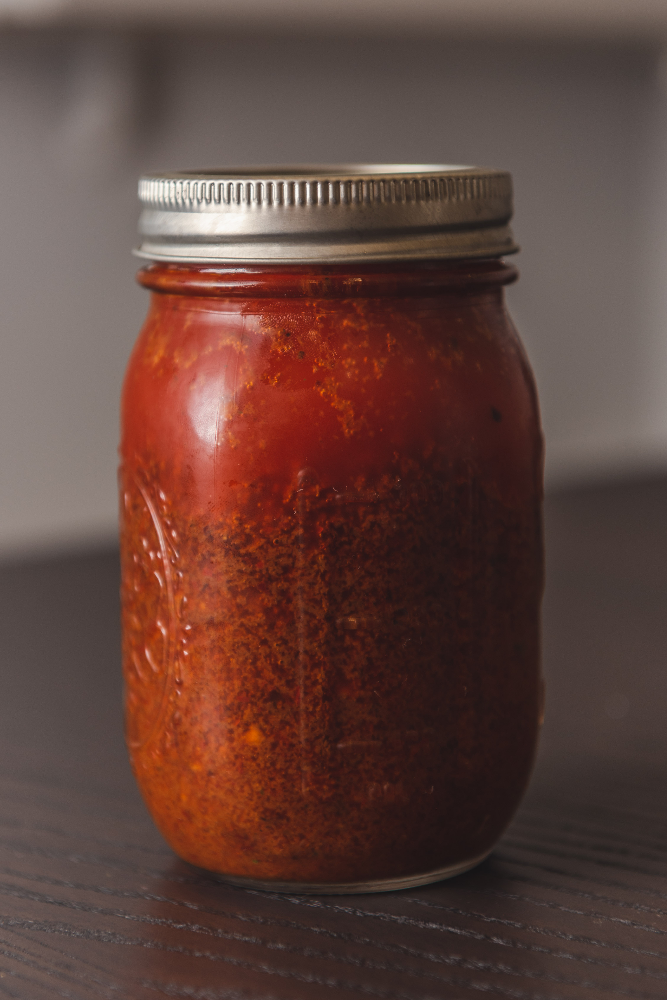
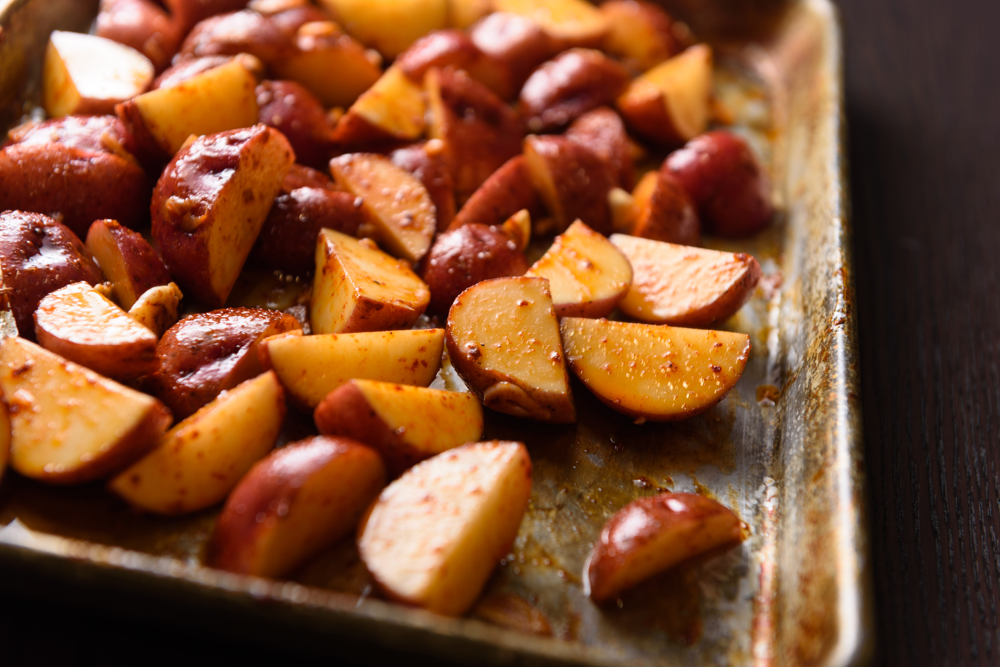
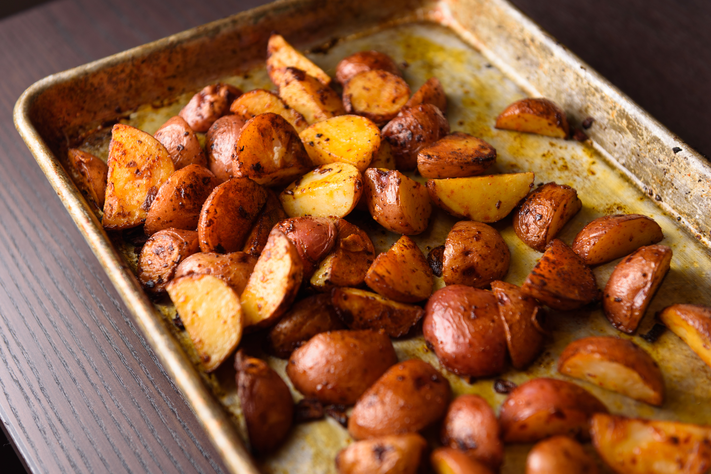
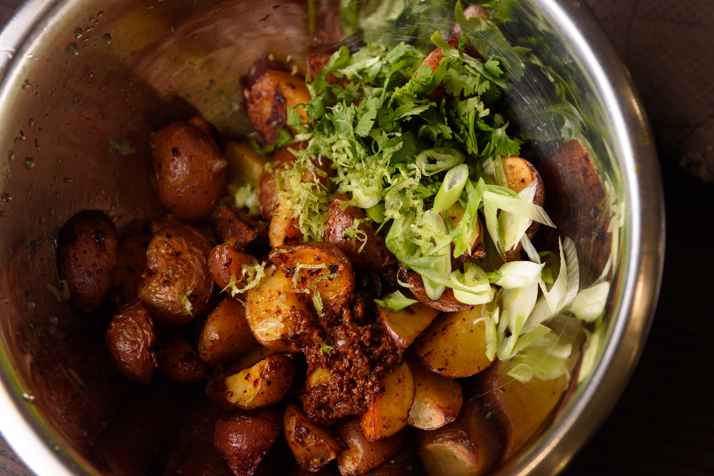

Perhaps the only trait I exhibit from my Irish heritage is my love for potatoes. I usually season my potatoes with dryer spices, and maybe some citrus juice, but adding a chili oil can be a great way to spice things up! Chili oil is predominant in Sichuan cuisine, but nothing stopping you from using any other type of chili or add-in spices. Instead of a crispy potato that's dry on the outside, you end up with a moist and juicy potato - I like a creamy potato over a waxy here one here -  like a red or russet.

First, we'll need to make a chili oil - this is the same concept and technique as a sichuan chili crisp, except here we'll use a variety of mexican chilies - I like to use a mix of a couple: guajillo and cascabel for some fruitiness, chipotle for smokiness, ancho for some heat, but you can use any that compliment each other.

1. With a dry frying pan on high heat, toast 1 tablespoon of cumin seeds for 60 seconds until aromatic, and set aside.
2. Toast around 10 chilies until slightly darkened, and set aside.
3. Once they have cooled, remove most of the seeds, and all the stems. We don't want the heat to overpower the flavor notes we're trying to extract
4. Heat a 1tbsp of oil and fry 1/2 a thinly sliced onion until deeply browned, and then add some crushed garlic, Add 1-2 cups of additional oil, bring to ~200°F, add back the chili and cumin, stir, and remove from the heat.
5. Once it's cooled, process in a blender or food processor until smooth.

You'll notice that when you jar it and let it settle, you'll be left with red oil on the top, and bits of ground up paste on the bottom. We'll want to use both!

Dice some potatoes and toss with our chili oil, sliced garlic, and some salt. Aim for the pure oil over the crisp that's settled for the bottom - it's more prone to burning. 

Roast at 450 for around 20 minutes, flipping halfway through when a sufficient crust has built up on the bottoms. 

Remove, toss with chili crisp, and equal parts lime zest, lime juice, red wine vinegar, cilantro, green onions. Cayenne can be added for additional heat.

