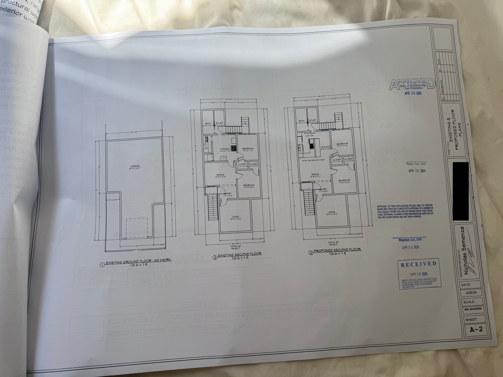

import LeftRightImage from '@/components/LeftRightImage.astro';
import GalleryView from '@/components/GalleryView.astro';
import DatePill from '@/components/DatePill.astro';

Most of 2024 was spent renovating our kitchen.

We spent hundreds of hours planning, demolishing, and rebuilding.

<iframe
  src="https://www.nicky.photos/frame/slideshow?key=PcvPnm&speed=1&transition=fade&autoStart=1&captions=0&navigation=1&playButton=0&randomize=1&transitionSpeed=1"
  class="w-full"
  height="600"
  frameborder="no"
  scrolling="no"
></iframe>
[view all photos here](https://www.nicky.photos/Other/2024-Kitchen-Remodel/)

## Project Overview and Scope

We did all of the following:

- **design**: Modeled in 2D and 3D, ensured all appliances would fit and relevant codes were met.
- **permitting**: Prepared architectural plans and permit documents. submitted permits to city, scheduled and passed inspections.
- **demolition**: Removed old appliances, cabinets, flooring, plaster, lath, and framing.
- **framing**: New framing and fire blocking, new exterior insulation.
- **electrical**: Entirely new outlets, lights, and homeruns to panel.
- **mechanical**: New hood exhaust venting to the roof.
- **plumbing**: New gas line from meter, new water supply, new DWV (I worked alongside a plumber for a week for this one).
- **painting**: Primed, painted, and caulked walls and ceilings.
- **millwork**: New panel moulding, new casings, made custom baseboards and windowsills.
- **cabinetry**: Designed and fabricated 19 new custom cabinets - walnut doors and drawers with custom hardwood handles.
- **project management**: Scheduled and coordinated all trades, deliveries, and inspections.

And subcontracted out these:

- **hauling**: Scheduled removal all the debris from the backyard.
- **drywall**: Managed the hanging, taping and mudding to level 5 finish.
- **countertops**: Oversaw templating, fabrication, and installation of quartzite .
- **flooring**: Had a crew sand and refinish the original wood flooring.
- **roofing**: Hired out the flashing installation and waterproofing.

We took a 6 week sabbatical from work and worked around 60 hours a week, taking occasional days off to rest. Once back at work, I spent 10-20 hours a week on evenings and weekends.

## Planning

Before we even moved in, we knew that we wanted/needed to renovate the kitchen. The house was built in 1886, and while the flooring, cabinets, and appliances had been slightly updated, most of the kitchen was decades old, if not more.

<GalleryView gallerySlug={'2024_before'} />

### Preliminary Research

First, Rebecca picked the overall design style.

At this point i'd never made anything resembling a cabinet before, so I spent a lot of time researching how to build them. I watched a lot of youtube videos, and made a simple euro style cabinet as a test. I also made som prototypes for walnut edgeding on plywood and some handle styles. More on this in the <a href="#cabinets"> Cabinets</a> section.

<GalleryView gallerySlug={'2024_04_06_testcabinet'} />

### Materials, Fixture, and Appliance Selection

This process went in parallel a little with developing the plans, but before we could finalize some details we needed to figure out what fixtures we were going to use. For example, the dimensions of the of the fridge and the sink varied between models and affects the entire cabinet layout. Some details wouldn't be necessary until later, but I wanted to figure them out so that we wouldn't be waiting for orders to ship (the appliances took 6 weeks to be delivered).

Looking at countertops, testing stain colors

<GalleryView gallerySlug={'2024_02_planning'} />
Looking at walnut for cabinets, and specs for drawer slides.
<GalleryView gallerySlug={'2024_03_planning'} />

We landed on the following:

#### appliances

- [Wolf GR366 36" Gas Range](https://www.subzero-wolf.com/wolf/ranges/gas-range/36-inch-gas-range-6-burners).
- [Subzero 30" Over-Under Fridge](https://www.subzero-wolf.com/sub-zero/full-size-refrigeration/builtin-refrigerators/30-inch-built-in-over-under-refrigerator-freezer). While expensive, this is one of the few high-capacity 30 inch fridges that wasn't ugly - we didn't really have space to squeeze in a more standard 36 inch size.
- [Bosch 800 Series Dishwasher](https://www.bosch-home.com/us/en/mkt-product/dishwashers/top-controls/SHX78CM5N)
- [Wolf 36" Hood Liner with 1200 CFM Blower](https://www.subzero-wolf.com/wolf/range-hood/36-inch-pro-hood-liner-22-inch-depth). I specifically wanted a hood that had baffles to catch grease, instead of a mesh filter that's harder to clean.

Appliances were purchased and delivered from [Ferguson](https://www.ferguson.com/)

#### plumbing fixtures

- [KRAUS Kore 30-Inch Undermount Workstation](https://www.kraususa.com/kraus-kwu110-30-workstation-30-undermount-16-gauge-stainless-steel-single-bowl-kitchen-sink-1.html)
- [California Faucets](https://www.calfaucets.com/) Poetto line for the faucet, soap dispenser, and disposal switch
- [Max Flow water filter](https://www.ewswater.com/product-page/max-flow). This is a filter that's high flow so that it can be put inline with the cold water line for the faucet, removing the need for a dedicated filtered water tap.
- [InSinkErator Evolution](https://www.insinkerator.com/en-us/shop/insinkerator/insinkerator-evolution-75hp) garbage disposal

Faucets were sourced from [Lutz Kitchen and Bath](https://www.lbksf.com/)

#### cabinetry and countertops

- Soft close undermount drawer slides from [Salice](https://www.salice.com/us/en/products/runners-and-space-organizers)
- [Blum](https://www.blum.com/us/en/) soft close hinges
- [Rubio Monocoat](https://rubiomonocoatusa.com/) in Pure for the finish on the walnut cabinets
- Walnut and Maple plywood, along with walnut boards from [Moore Newton](https://www.moorenewton.com/)
- the Coutnertop is Taj Mahal from [MSI](https://www.msisurfaces.com/quartzite/taj-mahal/), leathered, fabricated, and installed by [California Marble & Stone](https://californiamarbleandstone.com/)

#### lighting and Electrical

- Pendant lights from [Lostine](https://lostine.com/products/lawrence-pendant-oil-rubbed-brass)
- Entra Trimless 3" Downlight from [Visual Comfort](https://v1.element-lighting.com/Products/Details/ENTRA-3-LED-Adjustable-Downlight)
- Rotary Dimmers from [Forbes & Lomax](https://www.forbesandlomax.com/)
- Lutron Claro screwless wallplates, flush mounted with [Flushtek](https://flushtek.com/) router jig
- Dim-to-Warm LED strips from [Flexfire LEDs](https://www.flexfireleds.com/)

#### Interesting details

- [Mud in Access Panel](https://www.accessdoorsandpanels.com/22-x-22-flush-access-door-with-concealed-latch-and-drywall-flange/) for attic access
- [Egg and Dart Moulding](https://www.osbornewood.com/products/carved-egg-dart-moulding-4?variant=2700310) and [Corbels](https://www.osbornewood.com/products/corinthian-corbel?variant=2219644) from Osbone Wood
- [Panel Moulding](https://www.architecturaldepot.com/PML01X00SE.html) from Architectural Depot
- [Corner Applique](https://www.etsy.com/listing/784651801/baroque-carved-onlay-decorative-corner?ref=yr_purchases) from Carved Decor
- [Flute and Reed casing](https://kelleher.com/product/flute-reed-casing-7/) and [Bullseye block](https://kelleher.com/product/square-edge-bullseye-block-4/) from Kelleher
- Fluted glass from [Fab Glass and Mirror](https://www.fabglassandmirror.com/)

#### Drawing and Project Management

- [Chief Architect](https://www.chiefarchitect.com/) for drawing and visualization
- [Autocad LT](https://www.autodesk.com/products/autocad-lt/overview) for simpler 2D detail drawings
- [Notion](https://www.notion.so/) for project management and tracking purchases
- [Google Sheets](https://www.google.com/sheets/about/) for tracking cabinet buildings
- [Cutlist Optimizer](https://www.cutlistoptimizer.com/) for optimizing plywood cuts

### Layout, Permitting

In <DatePill d="November 2023" />, I started drawing some as-builts, and playing with potential layouts. I slowly refined on and off, and then In <DatePill d="Feb 2024" /> we had it mostly finalized and I made some 3D prints to visualize the different appliances.

<LeftRightImage
  base="kitchen-renovation"
  images={[
    'planning/nov3_2023_as_built_1.jpeg',
    'planning/nov6_2023_initial_sketch.jpeg',
    'planning/feb25_3dmodel.jpeg',
  ]}
  cols={3}
/>

For developing the plans, I used Chief Architect. All in, I spent over 30 active hours on the computer building the construction documents. I modeled everything in 2D and 3D, allowing me to generate visualizations as well as prepare all the required plans for permitting to succeed.

<LeftRightImage
  base="kitchen-renovation"
  images={[
    'planning/ca_timetracker.png',
    'planning/apr8_2024_elec.png',
    'planning/apr8_2024_elev.png',
    'planning/apr8_2024_rendering.png',
  ]}
  cols={2}
/>
I hired a [drafting firm](https://gratefulcad.com/) to help review the plans and
give me some corrections before taking them to the city
<DatePill d="April 26, 2024" />: I went downtown to the planning department
before work and went through the permitting process. I had to bring a bunch of
forms along with a 24"x36" plan set, and was sent around to a couple different
departments. Plans were approved on the first try!

## Demolition

<DatePill d="May 13, 2024" /> We started our 6 week break from work, and
demolition began!

First, I put down floor protection and plastic sheeting with zippers everywhere to contain the dust. I setup a box fan in the window to achieve negative pressure.

<GalleryView gallerySlug={'2024_05_14_demoprep'} />

Then we could finally begin. I capped the water lines, gas lines, and disconnected the relevant electrical circuits. Then we removed the cabinets, countertops, and appliances, and started removing some drywall. The wall behind the fridge confirmed my discovery that the furnace exhaust was going to be in the way. There was a whole 3 sq ft mechanical chase sitting there with old faux brick wallpaper and shelf brakcets! More on that later.

<GalleryView gallerySlug={'2024_05_15_16_demo'} />

The majority of the walls were old lath and plaster, so we spent a couple of days ripping the plaster off, bagging it, and then prying off the hundreds of pieces of wood lath. I was expecting it, but we uncovered some early 1900s era electrical wiring, both cloth insulated and knob and tube ([Old Electrical Wiring Types](https://inspectapedia.com/electric/Old_Electrical_Wiring.php)). I did some forensics beforehand to inventory every circuit, which was helpful since the all the ceiling lights in the whole house were connected via the kitchen.
Once all the mess of the walls was gone, we removed some non-load-bearing walls to open up the space and then continued with scraping off 3 layers of linoleum off the floor. I was suspicious of the old flooring so I got an asbestos test, but thankfully it came back negative.

<GalleryView gallerySlug={'2024_05_demo'} />

### Electrical & HVAC relocation

Since the furnace was vertically exhausting through the area that would become exposed in the future, we had to reroute it. Unfortunately, there was no room to reroute it to the roof anywhere! Instead, the easiest solution was to get an entirely new furnace, but this time a 90% efficiency one which was capable of venting horizontally. Even in retrospect, this was the only solution even if it was expensive (and the old furnace was fairly new!). I hired the furnace replacement out.
We did go without working ceiling lights in a couple rooms for a couple weeks until I finally got around to reconnecting those to new circuits.

## Rebuilding: Framing thru Drywall

Now that all the dirty work was done, it was time to rebuild.

### Framing

There wasn't too much framing work:

- A pony wall to house the plumbing and electrical for the island (peninsula)
- Blocking for screwing wall cabinets to, along with fire blocking at the top of the stud bays (the house is balloon framed)
- An archway, roughly inthe same place as the wall that removed
  <GalleryView gallerySlug={'2024_06_framing'} />

### Rough Electrical

First we installed all of the recessed can lights, hangers for the pendant lights, and electrical boxes for the outlets. Then, it was time to wire everything together.

Since the existing electrical panel was both pretty full and a meter-main combo, I decided to add a subpanel next to it to have a fresh start without having to involve the electrical utility (since they own the meter side).

Many of the appliances ask for a dedicated circuit, so we ended up with 10 new home runs to the subpanel. I ran THHN wire through 1/2" EMT conduit from the subpanel along the ceiling of the garage, and then transitioned into romex for running through the walls. Then it was time for the electrical rough inspection, everything passed!

<GalleryView gallerySlug={'2024_06_electrical'} />

### Rough Plumbing

I was a little intimidated by doing all of the plumbing work, but I got a reccomendation for a great plumber from a friend. He let me work along side him so I was able to learn a lot in the process.

- **Gas**: We ran an entirely new gas line from the meter to the kitchen, furnace, and water heater. This was necessary because the current line was undersized for the 6 burner stove, and we are also planning on adding a backyard firepit. I did the sizing calculations to make sure that the system will be able to handle all the BTU load.
- **Water**: New 1/2" copper lines for the sink, dishwasher, and fridge.
- **Drain / Waste**: New copper drain pipe connecting to the existing cast iron stack.
- **Vent**: New Copper/ABS vent pipe for the island, terminating above the roof.

Typically gas is threaded and copper is soldered, but we used ProPress and MegaPressG fittings for a majority of the connections

<GalleryView gallerySlug={'2024_06_plumbing'} />

### Insulation

This was the easiest step! We used R13 for the exterior walls. Another inspection passed, and we were ready for drywall.

<GalleryView gallerySlug={'2024_06_insulation'} />

### Drywall

We subbed out the drywall, and I have 0 regrets. They delivered and hung over 30 sheets, and then taped, mudded and added bullnose corner beads. Then they sanded and added mud to achieve a smooth level 5 finish.

<GalleryView gallerySlug={'2024_07_drywall'} />

## Detailed Touches and Interiors

### Painting

After picking between 6 shades of white, we landed on Alabaster by Sherwin Williams. It looks beige on the screen, but it's a nice cool white in person.

  SW7008

We primed the walls and ceilings, and then gave them all 2 coats. We also
painted wall moulding with the same paint before isntalling it. The baseboards
and other high-traffic trim was painted with Urethane Enamel from Sherwin
Williams
<GalleryView gallerySlug={'2024_07_paint'} />

### Trim & Millwork

The trim was quite intricate. We bought the moulding from a variety of sources:

- Egg and Dart moulding, 2 sizes of corbels, flexible moulding, and a corner applique on the archway
- Flute and Reed casing, and bullseye blocks for the doorways and windows

I made many of the trim pieces myself from S3S dimensional lumber:

- New window sill
- New over-door window frame with custom fluted glass
- baseboards from poplar with inset outlets
- hood surround above cabinets
  <GalleryView gallerySlug={'2024_07_trim'} />

### Flooring

This was another thing we hired out. It didn't take them much time but I didn't want to deal with renting a flooring sander and sourcing the right stains. I was able to find the company that refinished the floors in 2022 before we moved in, so they knew which stain to use to match. The transition came out great, and has only blended in further over time.

<GalleryView gallerySlug={'2024_07_flooring'} />

## Cabinets

Now that all of the messy work was done, it was time to start on the cabinets, while keeping the walls and floors in pristine condition of course.
More importantly, the plastic sheeting could finally come down, after <DatePill d="68 days" />.

{/* BEGIN CABINETS */}

### Design Inspiration

These pinterest photos are what I was given to replicate:

  <iframe
    src="https://assets.pinterest.com/ext/embed.html?id=21603273206609758"
    height="600"
    width="345"
    frameborder="0"
    scrolling="no"
  ></iframe>
  <iframe
    src="https://assets.pinterest.com/ext/embed.html?id=288089707406184937"
    height="600"
    width="345"
    frameborder="0"
    scrolling="no"
  ></iframe>

A few key design decisions that I contributed:

- Drawers, not doors, on lower cabinets. This increases usability to much, since you don't have to bend down and reach into the back of a cabinet
- Full height upper cabinets. Typically lower cabinets are 24" deep, but upper cabinets are only 15-18 inches deep. Partially this is because they are usually 2 feet above the countertops. I made the uppers the same full depth as the lowers, and raised them up to be 3 feet above the counters. This gives a nice working area under, and allows for plenty of storage in them.
- All soft close hardware. Both drawer slides and hinges are soft close so nothing bangs.
- Cabinets are frameless / euro style.
- Cabinets are built in metric using the 32MM standard.

Reportedly, true custom cabinets can cost upwards of $50-100K, but RTA cabinets would have been closer to $10K. I got a reccomendation to use [Barker Cabinets](https://www.barkercabinets.com/) but there were a couple reasons I wanted to build them from scratch.

- It seemed fun
- So that I could make unique cabinets (such as the dog food area) and they would match everything else
- So that I could ensure that the drawers/doors were grain matched as much as possible
- I would have had to modify the dooors and drawers to add the custom made wood handles anyways
- Lead times are 6-8 weeks and I wasn't confident I could order everything correctly in one go, with so many different parts.

Across the cabinets there's many different SKUs of materials used

- Interiors are made from prefinished 3/4" maple plywood. Maple plywood makes the inside brighter, and the UV coating is durable. It's not exactly "pretty", but great for something that isn't typically seen
- Backs are made from 1/4" prefinished maple plywood. This is also maple, but thinner and therefore cheaper.
- Drawer boxes are made from 1/2" prefinished walnut plywood. This is prefinished for the same reasons as the maple, but the walnut gives it a unique custom look
- Doors and drawer fronts are made from 3/4" unfinished walnut plywood with an MDF core. This is both expensive and heavy, but dimensionally stable and can be finished with a matte look.
- Drawer and door handles are made from S3S walnut that I cut, planed, routed, and sanded. They are finished with Rubio Monocoat along with the fronts, and they match very well.
- Edge banding is iron on walnut veneer. In a couple places I used solid walnut, but only for high traffic areas as it takes a lot more work.

### Cabinet Boxes

The design called for 12 base cabinets and 7 upper cabinets. The process was similar to both, the main difference being that the uppers don't have feet or toe kicks.

For each cabinet box, the process was as follows:

1. Break down 4x8 plywood pieces to size (sides, top, bottom, back). Used a Festool track saw for all these operations
1. Cut dados in the sides to capture the back. Used a Festool OF1010 router for this
1. drill 5mm holes for shelf pins / drawer slides / hinges in sides. Used a Festool LR32 rail and router for this
1. Iron on edge band the front of the sides, top, and bottom.
1. Trim edge banding flush with the maple plywood Used a Festool MFK700 for this
1. Stain edge banding with Rubio Mocoat
1. Drill pocket holes in the sides for assembly. Used a Kreg jig for this
1. Cut Domino mortises in the sides for the back. Used a Festool Domino DF500 for this
1. Assemble the box using pocket screws and dominos.
1. Install leveling feet (only for base cabinets)
1. Carry cabinets upstairs and place in position
1. Install drawer slides or hing plates and shelf pins.
1. Install drawer boxes or doors

Instead of a table saw, I performed 90% of the cuts and other operations on a [Dash-Board](https://www.dashboardpws.com/) workbench.

<GalleryView gallerySlug={'2024_07_aug_cabinets'} />

### Drawer Boxes and Trim

The drawer boxes had 1/2" bottoms instead of the standard 1/4" so they can accommodate a stack of cast iron pans - the drawer slides can support over 100 lbs.

The process was similar, albeit at a smaller scale. Instead of pocket screws, I used glue since the material is too thin (`12mm`) for pocket screws to grip securely.

<GalleryView gallerySlug={'2024_08_aug_cab_drawers_trim'} />

### Fronts and Handles

The base cabinets had 19 drawers, and the uppers had 8 doors. Each door/drawer has a front that's edge banded, and connected to a handle that matches in length. Once the handle and panel are glued together, it gets holes drilled for the hinge cups, and then stained on all surfaces.

<GalleryView gallerySlug={'2024_08_drawer_fronts'} />
{/* END CABINETS */}

## After Cabinets

### Rough + Finish Mechanical

Before I started hanging the cabinets, the last rough work was to install the range hood and the ducting to the outside. I opted to do this before installing the cabinets just to make my life easier. I've seen people slide in the range hood from underneath before, but that seemed harder.
I ran a new 10" duct through the ceiling, up into the attic, 90° to run latterally through the attic in order to achieve the necessary clearence from the property line, and then swept up and through the roof. I had a roofer help with ensuring that the new 10" hole in the roof was properly flashed and sealed. Aluminum tape, sheet metal screws, and plastic strapping was used to secure and seal the ductwork.

<GalleryView gallerySlug={'2024_07_aug_mech'} />

### Countertops

We had a great countertop fabricator who took care of the templating, leathering, cutting, and installing.

<GalleryView gallerySlug={'2024_09_oct_countertop'} />

### Finish Electrical + Plumbing

With the countertop isntalled and the sink basin glued to it, we could finally hook up the sink, disposal, and dishwasher. Around this time we also installed all the outlets and their cover plates. I waited until after the countertop to install the pendant lights so they wouldn't be in the way.

<GalleryView gallerySlug={'2024_08_finish_elec_plumbing'} />

## Final Touches

On <DatePill d="October 23, 2024" /> I passed the final building inspection and closed the permits. This was before we were finished with painting and some other small punch list items that don't require a permit, and in <DatePill d="November 2024" /> we declared the project done!

We had a long list of small touches, including painting the dining room to match, transitioning 100 year old trim into 100 day old trim, an d doing some cleanup and organizing

<GalleryView gallerySlug={'2024_11_finishing'} />

## Result

Here's some side by side before and after photos

<LeftRightImage
  base="kitchen-renovation"
  images={[
    'before-after-pics/before-br.jpeg',
    'before-after-pics/after-br.jpg',
  ]}
/>
<LeftRightImage
  base="kitchen-renovation"
  images={[
    'before-after-pics/before-sunroom.jpeg',
    'before-after-pics/after-sunroom.jpg',
  ]}
/>
<LeftRightImage
  base="kitchen-renovation"
  images={[
    'before-after-pics/before-dining.jpeg',
    'before-after-pics/after-dining.jpg',
  ]}
/>

My 3D model versus the final product

<LeftRightImage
  base="kitchen-renovation"
  images={['before-after-pics/after-cad.jpeg']}
  cols={1}
/>

## Statistics

- **43** sheets of plywood
- **212** BF of hardwood
- **3** lumber deliveries, 8 plywood/hardwood deliveries
- **600** feet of iron on edge banding
- **500+** Festool Domino tenons
- **400+** Kreg pocket screws
- **25** sheets of drywall
- **100+** feet of pipe
- **300+** feet of wire
- **18** pairs of drawer slides
- **28** door hinges
- **383** purchases
- **6** DBI inspections (4 building, 2 electrical, 2 plumbing)
- **$150K+** savings by doing it ourselves (approx)
